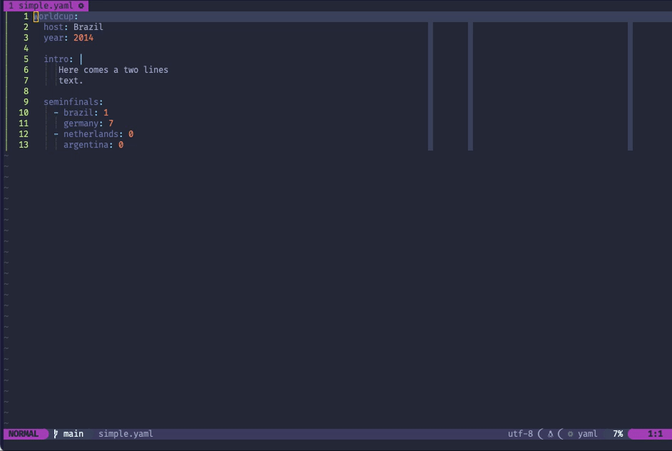

# yaml.nvim [](https://github.com/cuducos/yaml.nvim/actions/workflows/tests.yml)

Simple tools to help developers working YAML in [Neovim](https://neovim.io).

Assuming `yaml = require("yaml_nvim")` for the Lua API:

| Command | Lua API | Description |
|:--|:--|:--|
| `:YAMLView` | `yaml.view()` | Shows the full path and value of the current key/value pair |
| `:YAMLYank [register]` | `yaml.yank_all([register])` | Yanks the full path and value of the current key/value pair. The default register is the unnamed one (`"`) |
| `:YAMLYankKey [register]` | `yaml.yank_key([register])`  | Yanks the full path of the key for the current key/value pair. The default register is the unnamed one (`"`) |
| `:YAMLYankValue [regster]` | `yaml.yank_value([register])`  | Yanks the value of the current key/value pair. The default register is the unnamed one (`"`) |
| `:YAMLQuickfix` | `yaml.quickfix()` | Generates a quickfix with key/value pairs |
| `:YAMLTelescope` | `yaml.telescope()`  | Full path key/value fuzzy finder via [Telescope](https://github.com/nvim-telescope/telescope.nvim) **if installed** |



## Requirements

* **Neovim 0.9** or newer
* [`nvim-treesitter`](https://github.com/nvim-treesitter/nvim-treesitter) with [YAML support](https://github.com/ikatyang/tree-sitter-yaml)

Telescope is **optional**.

<details>

<summary>What about older versions of Neovim?</summary>

* For **Neovim 0.7 or 0.8**, pin to [`7925bd2`](https://github.com/cuducos/yaml.nvim/commit/7925bd2bf03c718996ccad7e1a49eafe40cd3246)
* For **Neovim 0.5 or 0.6**, pin to [`155c23d`](https://github.com/cuducos/yaml.nvim/commit/155c23de8f99fdb424f8aa713bcb993cc2538c6c)

 </details>

## Install

### With [`lazy.nvim`](https://github.com/folke/lazy.nvim)

```lua
{
  "cuducos/yaml.nvim",
  ft = { "yaml" }, -- optional
  dependencies = {
    "nvim-treesitter/nvim-treesitter",
    "nvim-telescope/telescope.nvim", -- optional
  },
}
```

### With [`packer.nvim`](https://github.com/wbthomason/packer.nvim):

```lua
use {
  "cuducos/yaml.nvim",
  ft = { "yaml" }, -- optional
  requires = {
    "nvim-treesitter/nvim-treesitter",
    "nvim-telescope/telescope.nvim" -- optional
  },
}
```

### With [`vim-plug`](https://github.com/junegunn/vim-plug):

```viml
Plug 'nvim-telescope/telescope.nvim' " optional
Plug 'nvim-treesitter/nvim-treesitter'
Plug 'cuducos/yaml.nvim'
```

## Configuration

### Showing the YAML patch and value in Neovim's winbar

```lua
vim.api.nvim_create_autocmd({ "FileType" }, {
	pattern = { "yaml" },
	callback = function()
		vim.opt_local.winbar = [[%]]
	end,
})
```

## Reporting bugs and contributing

There is a mini toolchain to help you test the plugin in isolation using a container. It requires:

* [Lua](https://www.lua.org/)
* [Docker](https://www.docker.com/) or [Podman](https://podman.io/)

| Command | Description |
|---|---|
| `./manage build` | Builds the container |
| `./manage test` | Runs the tests inside the container |
| `./manage nvim` | Opens the container's Neovim with a sample YAML file |
